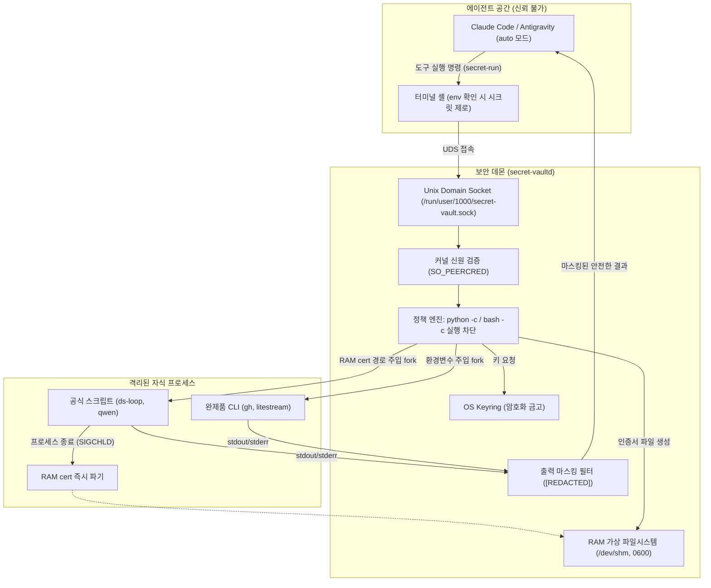
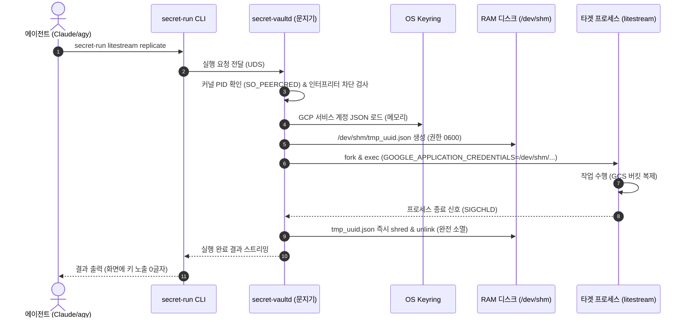

# 제8장: 시스템 컴포넌트 및 데이터 흐름도

### 8.1 전체 시스템 구조도

```mermaid
flowchart TD
    subgraph AgentSpace["에이전트 공간 (신뢰 불가)"]
        Agent["Claude Code / Antigravity (auto 모드)"]
        Terminal["터미널 셸 (env 확인 시 시크릿 제로)"]
        Agent -->|"도구 실행 명령 (secret-run)"| Terminal
    end

    subgraph DaemonSpace["보안 데몬 (secret-vaultd)"]
        UDS["Unix Domain Socket (/run/user/1000/secret-vault.sock)"]
        KernelCheck["커널 신원 검증 (SO_PEERCRED)"]
        Policy["정책 엔진: python -c / bash -c 실행 차단"]
        Keyring["OS Keyring (암호화 금고)"]
        RAMFS["RAM 가상 파일시스템 (/dev/shm, 0600)"]
        Sanitizer["출력 마스킹 필터 ([REDACTED])"]

        Terminal -->|UDS 접속| UDS
        UDS --> KernelCheck
        KernelCheck --> Policy
        Policy -->|"키 요청"| Keyring
        Policy -->|"인증서 파일 생성"| RAMFS
    end

    subgraph ExecSpace["격리된 자식 프로세스"]
        CLI["완제품 CLI (gh, litestream)"]
        Script["공식 스크립트 (ds-loop, qwen)"]

        Policy -->|"환경변수 주입 fork"| CLI
        Policy -->|"RAM cert 경로 주입 fork"| Script
        CLI -->|"stdout/stderr"| Sanitizer
        Script -->|"stdout/stderr"| Sanitizer
        Script -->|"프로세스 종료 (SIGCHLD)"| Cleanup["RAM cert 즉시 파기"]
        Cleanup -.-> RAMFS
    end

    Sanitizer -->|"마스킹된 안전한 결과"| Agent
```

---

### 8.2 시크릿 주입 및 파기 생명주기 (Sequence Diagram)

```mermaid
sequenceDiagram
    autonumber
    actor Agent as 에이전트 (Claude/agy)
    participant Runner as secret-run CLI
    participant Daemon as secret-vaultd (문지기)
    participant Keyring as OS Keyring
    participant RAMFS as RAM 디스크 (/dev/shm)
    participant Target as 타겟 프로세스 (litestream)

    Agent->>Runner: secret-run litestream replicate
    Runner->>Daemon: 실행 요청 전달 (UDS)
    Daemon->>Daemon: 커널 PID 확인 (SO_PEERCRED) & 인터프리터 차단 검사
    Daemon->>Keyring: GCP 서비스 계정 JSON 로드 (메모리)
    Daemon->>RAMFS: /dev/shm/tmp_uuid.json 생성 (권한 0600)
    Daemon->>Target: fork & exec (GOOGLE_APPLICATION_CREDENTIALS=/dev/shm/...)
    Target->>Target: 작업 수행 (GCS 버킷 복제)
    Target-->>Daemon: 프로세스 종료 신호 (SIGCHLD)
    Daemon->>RAMFS: tmp_uuid.json 즉시 shred & unlink (완전 소멸)
    Daemon-->>Runner: 실행 완료 결과 스트리밍
    Runner-->>Agent: 결과 출력 (화면에 키 노출 0글자)
```
